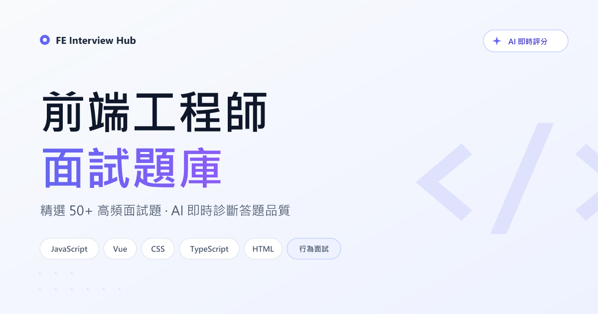

# FE Interview Hub — 前端工程師面試題庫

> 精選 80+ 前端面試題，涵蓋 JavaScript / Vue / CSS / TypeScript / HTML / 瀏覽器原理 / Web Vitals / 行為面試，搭配 OpenAI 即時評分，幫你把「會答」練成「答好」。



---

## ✨ 主要功能

### 對一般使用者

| 功能 | 說明 |
|------|------|
| **雙語題庫** | zh-TW / en-US 全站 i18n，題目 + UI 同時切換，各語系有獨立的 canonical URL 與 hreflang |
| **分類瀏覽** | 8 大分類：JavaScript、Vue、CSS、TypeScript、HTML、Web Vitals、Browser 原理、行為面試，分類頁帶題目計數 |
| **題目詳解** | Markdown 渲染，自動產生側欄 TOC、麵包屑、上下題導覽、Callout 語法支援 |
| **AI 模擬面試** | 輸入答案後呼叫 GPT-4o-mini 給 0-100 精準度分數、列出缺漏要點、產生優化後範例答案 |
| **語音作答** | 使用 Whisper 把中文/英文語音轉文字，比 Web Speech API 準確度高 |
| **每日次數限制** | 免費額度預設 10 次/人/日，白名單 email 無限制 |
| **收藏功能** | 登入後可收藏題目，集中在「我的收藏」頁複習 |
| **Google OAuth 登入** | 透過 Supabase Auth 實作，零密碼管理 |

### 對管理員

| 功能 | 說明 |
|------|------|
| **獨立後台** | `/admin` 入口，帳密認證，session-based cookie（httpOnly + SameSite strict + Secure） |
| **題目 CRUD** | 新增、編輯、刪除題目，中英文內容並列編輯 |
| **Markdown split-view 編輯器** | 左側 textarea 輸入、右側即時預覽，支援 Callout、Code block |
| **分類 / 難度 / 標籤管理** | 下拉選單 + 逗號分隔標籤輸入 |
| **題目列表** | 搜尋 slug / 標題、分類過濾、一鍵發布切換、二次確認刪除 |

### SEO / 分享

- Server-Side Rendering（Nuxt SSR）— 內容直接出現在 HTML source
- Sitemap 自動產生（`@nuxtjs/sitemap`），排除 `/admin`、`/bookmarks`、`/auth`
- 動態 `robots.txt`（從 runtimeConfig 讀取 siteUrl）
- 題目頁使用 **QAPage + Question + acceptedAnswer** 結構化資料，目標 Google Q&A Rich Results
- 首頁 `WebSite` JSON-LD
- 全站 OpenGraph / Twitter Card + 1200×630 預覽圖
- hreflang（`zh-TW` / `en-US` / `x-default`）

---

## 🧱 技術架構

### 前端

| 類別 | 技術 |
|------|------|
| 框架 | **Nuxt 3**（`compatibilityVersion: 4`，SSR 預設） |
| 語言 | TypeScript |
| UI | **Tailwind CSS v4**（`@tailwindcss/vite`）+ 自訂 CSS 變數 |
| 排版 | `@tailwindcss/typography`（題目詳解頁） |
| i18n | `@nuxtjs/i18n` v9，`strategy: 'prefix'` |
| Markdown | `marked` v18（獨立 `new Marked()` instance，避免汙染全域 singleton） |

### 後端（Nitro server routes）

| 類別 | 技術 |
|------|------|
| Runtime | Nitro（Nuxt 內建，Node / Edge 皆可部署） |
| Session | `h3` `useSession`（加密 cookie，`SESSION_SECRET` 簽章） |
| 資料庫 SDK | `@nuxtjs/supabase` v2（`serverSupabaseServiceRole` / `serverSupabaseUser`） |
| AI | `openai` SDK — `chat.completions` 呼叫 `gpt-4o-mini`、`audio.transcriptions` 呼叫 `whisper-1` |

### 資料層

| 類別 | 技術 |
|------|------|
| 資料庫 | **Supabase (PostgreSQL)** |
| Auth | **Supabase Auth**（Google OAuth provider） |
| Storage | 目前未使用（題目與翻譯都在 DB） |

### 工具鏈

| 類別 | 工具 |
|------|------|
| 測試 | Vitest + `@vue/test-utils` + `happy-dom`（`@nuxt/test-utils`） |
| 圖片生成 | `@resvg/resvg-js`（把 `og-image.svg` 編成 PNG） |
| TypeScript | v5.8 |

---

## 🗂️ 資料庫 Schema（Supabase）

```
questions
├── id            uuid primary key
├── slug          text unique
├── category      text            -- javascript / vue / css / typescript / html / web-vitals / browser / behavioral
├── difficulty    text            -- basic / intermediate / advanced
├── tags          text[]
├── is_published  boolean
└── created_at    timestamptz

translations
├── id            uuid primary key
├── question_id   uuid → questions.id (cascade)
├── locale        text            -- 'zh' or 'en'
├── title         text
└── body_md       text
    unique (question_id, locale)

bookmarks
├── id             uuid primary key
├── user_id        uuid → auth.users.id
├── question_slug  text
└── created_at     timestamptz
    unique (user_id, question_slug)

practice_logs
├── id             uuid primary key
├── user_id        uuid → auth.users.id
├── question_slug  text
├── question_text  text
├── user_answer    text
├── ai_feedback    jsonb          -- { accuracy: {score, summary}, gaps: [], example: '' }
├── locale         text
└── created_at     timestamptz
```

> RLS：新表預設停用 RLS，所有 mutation 透過 `serverSupabaseServiceRole`（server-only）進行，不會洩漏 service key 到客戶端。

---

## 🔌 API 端點

### 公開（不需登入）

| Method | Path | 說明 |
|--------|------|------|
| GET | `/api/questions?locale=zh` | 題目列表（不含 body_md） |
| GET | `/api/questions?locale=zh&slug=xxx` | 單題詳情（包含 body_md） |
| GET | `/robots.txt` | 動態 robots.txt |
| GET | `/sitemap.xml` | Nuxt sitemap |

### 需要 Supabase 登入

| Method | Path | 說明 |
|--------|------|------|
| GET | `/api/bookmarks` | 取得當前使用者的收藏 slug 清單 |
| POST | `/api/bookmarks/toggle` | `{ slug, action: 'add' \| 'remove' }` |
| POST | `/api/ai/evaluate` | `{ slug, questionText, answer }` → AI 評分結果 |
| POST | `/api/ai/transcribe` | FormData(audio + locale) → Whisper 轉文字 |

### 管理後台（需要 admin session）

| Method | Path | 說明 |
|--------|------|------|
| POST | `/api/admin/login` | `{ account, password }`，timing-safe 比對 |
| POST | `/api/admin/logout` | 清除 session |
| GET | `/api/admin/questions` | 所有題目（含翻譯） |
| GET | `/api/admin/questions/:id` | 單一題目 |
| POST | `/api/admin/questions` | 新增題目 + 雙語翻譯（失敗自動 rollback） |
| PUT | `/api/admin/questions/:id` | 更新題目 + 雙語翻譯（batched upsert） |
| DELETE | `/api/admin/questions/:id` | 刪除（FK cascade 連帶刪除 translations） |

---

## 🌐 外部服務

| 服務 | 用途 | 費用 |
|------|------|------|
| **Supabase** | PostgreSQL 資料庫 + Google OAuth | 免費層（500MB DB / 50k MAU） |
| **OpenAI** | `gpt-4o-mini`（AI 評分）、`whisper-1`（語音辨識） | 按使用量計費，已設日次數限制 |
| **Cloudflare Pages** | Static + Functions 部署 | 免費 |
| **Google Cloud Console** | OAuth 2.0 憑證設定（供 Supabase 使用） | 免費 |

---

## 🚀 快速開始

### 環境需求

- Node.js 20+
- npm 10+
- Supabase 專案（參見下方建表 SQL）
- OpenAI API Key
- Google OAuth 憑證（Supabase Auth 用）

### 安裝

```bash
git clone <this-repo>
cd "AI-Powered Frontend Interview"
npm install
cp .env.example .env    # 然後填入實際值
npm run dev
```

開發站：http://localhost:3000

### 環境變數

在專案根目錄建立 `.env`：

```bash
# Supabase (公開的 anon key)
NUXT_PUBLIC_SUPABASE_URL=https://xxxx.supabase.co
NUXT_PUBLIC_SUPABASE_KEY=<anon key>

# Supabase service role (server-only, 絕不可公開)
SUPABASE_SERVICE_KEY=<service role key>

# OpenAI
OPENAI_API_KEY=sk-proj-xxxx
DAILY_AI_LIMIT=10
BYPASS_EMAILS=you@example.com          # 逗號分隔，這些 email 不受每日限制

# 後台管理
BACKEND_ACCOUNT=admin
BACKEND_PASSWORD=<強密碼，建議 20+ 字元>
SESSION_SECRET=<openssl rand -hex 32 產生>

# 部署網址（部署時一定要改）
NUXT_PUBLIC_SITE_URL=https://your-domain.com
```

### 建立 Supabase 資料表

在 Supabase SQL Editor 依序執行：

```sql
-- questions
create table questions (
  id uuid primary key default gen_random_uuid(),
  slug text unique not null,
  category text not null,
  difficulty text not null,
  tags text[] default '{}',
  is_published boolean default true,
  created_at timestamptz default now()
);

-- translations
create table translations (
  id uuid primary key default gen_random_uuid(),
  question_id uuid references questions(id) on delete cascade,
  locale text not null,
  title text not null,
  body_md text not null,
  unique(question_id, locale)
);

-- bookmarks
create table bookmarks (
  id uuid primary key default gen_random_uuid(),
  user_id uuid references auth.users(id) on delete cascade,
  question_slug text not null,
  created_at timestamptz default now(),
  unique(user_id, question_slug)
);

-- practice_logs
create table practice_logs (
  id uuid primary key default gen_random_uuid(),
  user_id uuid references auth.users(id) on delete cascade,
  question_slug text not null,
  question_text text,
  user_answer text,
  ai_feedback jsonb,
  locale text,
  created_at timestamptz default now()
);
```

---

## 📁 專案結構

```
.
├── app.vue                        # Nuxt 根組件
├── error.vue                      # 全域錯誤頁
├── nuxt.config.ts                 # Nuxt 主設定
├── assets/css/                    # Tailwind 入口 + 自訂 CSS 變數
├── components/
│   ├── admin/                     # 後台專用（MarkdownEditor）
│   ├── bookmark/                  # 收藏卡片
│   ├── layout/                    # 全站共用（Header、Footer、Sidebar）
│   └── question/                  # 題目卡片、分類卡、Tag Badge
├── composables/
│   ├── useQuestions.ts            # 題目列表 + 過濾
│   ├── useCategories.ts           # 8 大分類 + 題目計數
│   ├── useBookmarks.ts            # 收藏 toggle
│   └── useSiteUrl.ts              # 取得 NUXT_PUBLIC_SITE_URL
├── i18n/i18n/                     # zh.json / en.json（langDir 指向 i18n/）
├── layouts/
│   ├── default.vue                # 一般頁面
│   ├── home.vue                   # 首頁
│   └── admin.vue                  # 後台
├── middleware/auth.ts             # Nuxt route middleware（收藏頁用）
├── pages/
│   ├── index.vue                  # 首頁（分類 grid + 熱門題）
│   ├── questions/
│   │   ├── index.vue              # 題目列表
│   │   └── [slug].vue             # 題目詳解（含 AI 面試）
│   ├── bookmarks/index.vue        # 我的收藏
│   ├── auth/callback.vue          # Supabase OAuth callback
│   └── admin/                     # 後台所有頁面
├── public/
│   ├── og-image.png               # 社群預覽圖
│   └── og-image.svg               # 可編輯原始檔
├── scripts/
│   ├── migrate-questions.ts       # 一次性：從舊 Markdown 匯入 Supabase
│   └── generate-og-image.mjs      # 從 SVG 產生 OG PNG
├── server/
│   ├── api/                       # 所有 API 端點（見上方 API 表）
│   ├── middleware/admin-auth.ts   # 守衛 /admin/* 與 /api/admin/*
│   ├── routes/robots.txt.ts       # 動態 robots.txt
│   └── utils/admin-session.ts     # 共用 session 設定
├── tests/                         # Vitest
└── utils/seo.ts                   # stripMarkdown / excerpt（SEO description）
```

---

## 🔧 常用指令

| 指令 | 說明 |
|------|------|
| `npm run dev` | 啟動開發伺服器（http://localhost:3000） |
| `npm run build` | 建置生產版本（輸出至 `.output/`） |
| `npm run preview` | 本地預覽生產建置 |
| `npm test` | 執行 Vitest |
| `node scripts/generate-og-image.mjs` | 重新產生 OG 圖片（修改 `og-image.svg` 後使用） |
| `npx tsx scripts/migrate-questions.ts` | 一次性匯入舊 Markdown 題目（初次部署用） |

---

## 🌩️ 部署到 Cloudflare Pages

1. **Cloudflare Pages → Connect to Git**：選擇這個 repo
2. **Build settings**：
   - Framework preset：`Nuxt.js`
   - Build command：`npm run build`
   - Build output directory：`dist`
   - Node version：`20`
3. **Environment variables**：貼上 `.env` 的所有變數
   - ⚠️ `NUXT_PUBLIC_SITE_URL` 要改成實際部署網址（`*.pages.dev` 或自訂域名）
4. **Supabase Auth redirect URLs**：在 Supabase dashboard 新增部署網址
   - `https://<your-site>/auth/callback`
5. 部署完成後驗證：
   - [Google Rich Results Test](https://search.google.com/test/rich-results) 貼題目頁 URL，確認 QAPage 判讀成功
   - [Facebook Sharing Debugger](https://developers.facebook.com/tools/debug/) 預覽 OG 圖
   - Google Search Console 提交 `sitemap.xml`

> 💡 `.pages.dev` 在 SEO 上屬於「免費託管子域名」，在競爭關鍵字上會被降權。想衝「前端面試題」第一頁建議買自訂域名，DNS 指到 Cloudflare Pages 即可（Cloudflare Pages 仍維持免費）。

---

## 📐 安全設計要點

- **Admin session cookie**：`httpOnly` + `sameSite: strict` + `secure`（生產環境）
- **Timing-safe 密碼比對**：`crypto.timingSafeEqual`
- **Service role key**：僅在 `server/` 目錄內使用，不會進 client bundle
- **Path guard**：`startsWith('/admin/')`（避免 `/admin-tools` 漏洞）
- **Non-atomic 補償**：新增題目失敗時回滾孤兒 row；更新題目用 batched upsert
- **404 / 500 分離**：避免 DB error 被誤判為 404

---

## 📝 授權

個人專案，尚未設定授權條款。如需使用請先聯繫作者。
